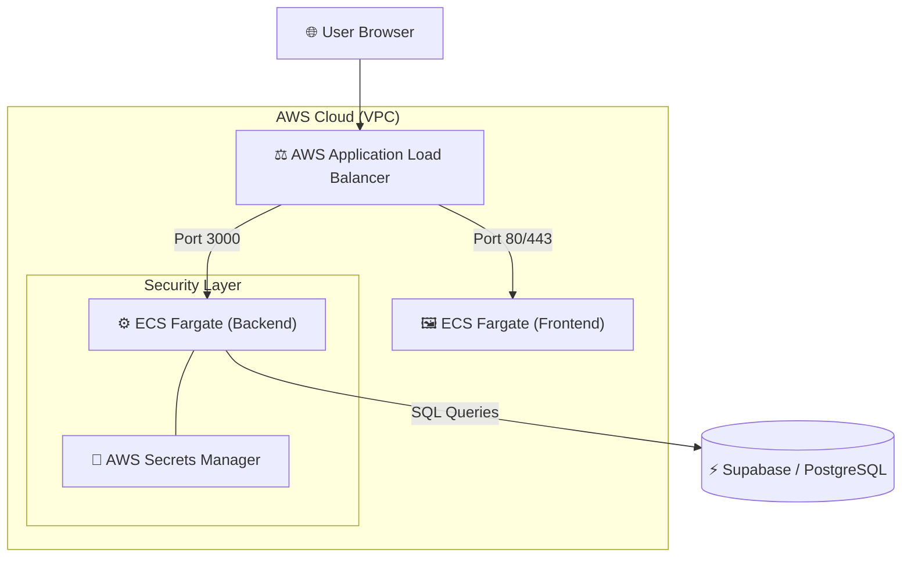
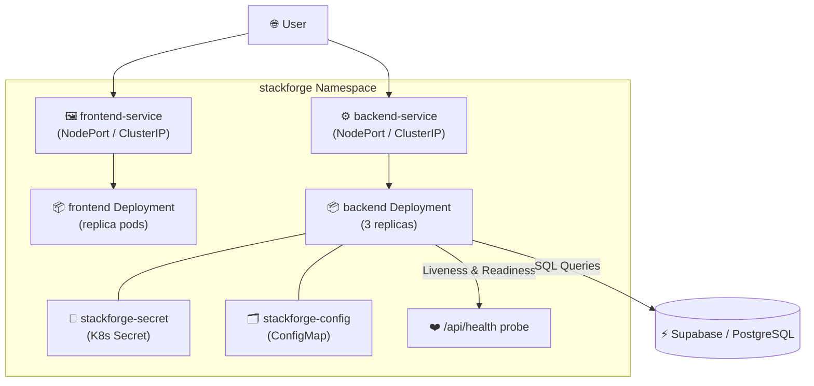

# ⚒️ StackForge

StackForge is a production-grade, full-stack task management ecosystem. This project served as a deep-dive exploration into modern cloud infrastructure, covering **AWS EC2**, **ECS (Elastic Container Service)**, and a full **Kubernetes** deployment with manifests for real-world orchestration.

## 🚀 The Mission: Cloud Exploration
The primary goal of this project was to move beyond internal development and master the complexities of deploying scalable, containerized applications to the cloud. Through StackForge, I explored and implemented:

*   **Infrastructure as Code**: Designing ECS task definitions *and* Kubernetes manifests for microservices.
*   **Containerization**: Building optimized Docker images for both frontend (Vite) and backend (Node.js).
*   **AWS ECS & Fargate**: Orchestrating containers without managing underlying EC2 instances directly.
*   **Kubernetes (k8s)**: Writing production-style manifests — Deployments, Services, ConfigMaps, Secrets, and Namespaces — with health probes and resource limits.
*   **Load Balancing**: Setting up an Application Load Balancer (ALB) to route traffic and handle SSL/CORS.
*   **Security & Configuration**: Leveraging AWS Secrets Manager (cloud) and Kubernetes Secrets (local/k8s) to protect sensitive environment variables.

---

## 🏗️ Architecture

### ☁️ AWS ECS Architecture


### ☸️ Kubernetes Architecture


---

## 🛠️ Tech Stack

### Frontend
- **Framework**: React 18 with Vite
- **Styling**: Tailwind CSS (Modern, Responsive Design)
- **State/API**: Axios with persistent interceptors

### Backend
- **Runtime**: Node.js & Express
- **Auth**: JWT (JSON Web Tokens) with secure cookie-less flow
- **Middleware**: Helmet, CORS, Morgan (Development logging)

### Database & Security
- **DB**: Supabase (PostgreSQL)
- **Cloud Config**: AWS Secrets Manager (ECS) / Kubernetes Secrets (k8s)
- **Environment**: Managed via `.env` (locally), ECS Secrets (AWS), and K8s Secret + ConfigMap (Kubernetes)

### Kubernetes
- **Manifests**: Namespace, Deployments, ClusterIP Services, ConfigMap, Secret
- **Replicas**: 3-replica backend with independent frontend pods
- **Health Checks**: Liveness & Readiness probes on `/api/health`
- **Resource Management**: CPU/Memory `requests` and `limits` per container
- **Config Injection**: All env vars injected via `secretKeyRef` from K8s Secret

---

## 📦 Infrastructure Highlights

### 🐋 Dockerized Services
The application is split into two primary services, each with its own `Dockerfile`, ensuring a consistent environment from development to production.

### ☸️ AWS ECS Fargate
By using Fargate, the services run on serverless compute, removing the need to patch or scale individual EC2 instances while maintaining the granular control of the ECS ecosystem.

### ☸️ Kubernetes Deployment (`k8s/`)
The `k8s/` directory contains a complete, production-style Kubernetes deployment:

| Manifest | Purpose |
|---|---|
| `namespace.yaml` | Isolates all resources under the `stackforge` namespace |
| `backend-deployment.yaml` | 3-replica backend with resource limits and health probes |
| `frontend-deployment.yaml` | Frontend pod deployment |
| `backend-service.yaml` | Exposes the backend within the cluster |
| `frontend-service.yaml` | Exposes the frontend within the cluster |
| `configmap.yaml` | Non-sensitive environment configuration |
| `secret.yaml` | Sensitive credentials (Supabase keys, JWT secret) |

### 🛰️ CI/CD Pipeline
Fully automated deployments via **GitHub Actions**. Every push to the main branch triggers:
1.  Docker build and tag.
2.  Push to **Amazon ECR (Elastic Container Registry)**.
3.  Update of the ECS Task Definition.
4.  Force deployment to the ECS Cluster.

---

## ⚙️ Local Development

### Prerequisites
- Node.js (v18+)
- Docker (for local container testing and k8s image builds)
- Supabase Project
- `kubectl` + a local cluster (e.g. **Minikube** or **kind**) for Kubernetes testing

### Kubernetes Setup
1. Build and tag images locally: `docker build -t backendkubernetesversion:v1 ./backend`
2. Apply manifests in order:
   ```bash
   kubectl apply -f k8s/namespace.yaml
   kubectl apply -f k8s/secret.yaml
   kubectl apply -f k8s/configmap.yaml
   kubectl apply -f k8s/backend-deployment.yaml
   kubectl apply -f k8s/backend-service.yaml
   kubectl apply -f k8s/frontend-deployment.yaml
   kubectl apply -f k8s/frontend-service.yaml
   ```
3. Verify pods: `kubectl get pods -n stackforge`

### Backend Setup
1. `cd backend`
2. `npm install`
3. Create `.env` based on `.env.example`.
4. `npm run dev`

### Frontend Setup
1. `cd frontend`
2. `npm install`
3. Create `.env` based on `.env.example`.
4. `npm run dev`

---

## 📜 License
Built to production standards with full CI/CD, Kubernetes orchestration, and cloud-native security.
